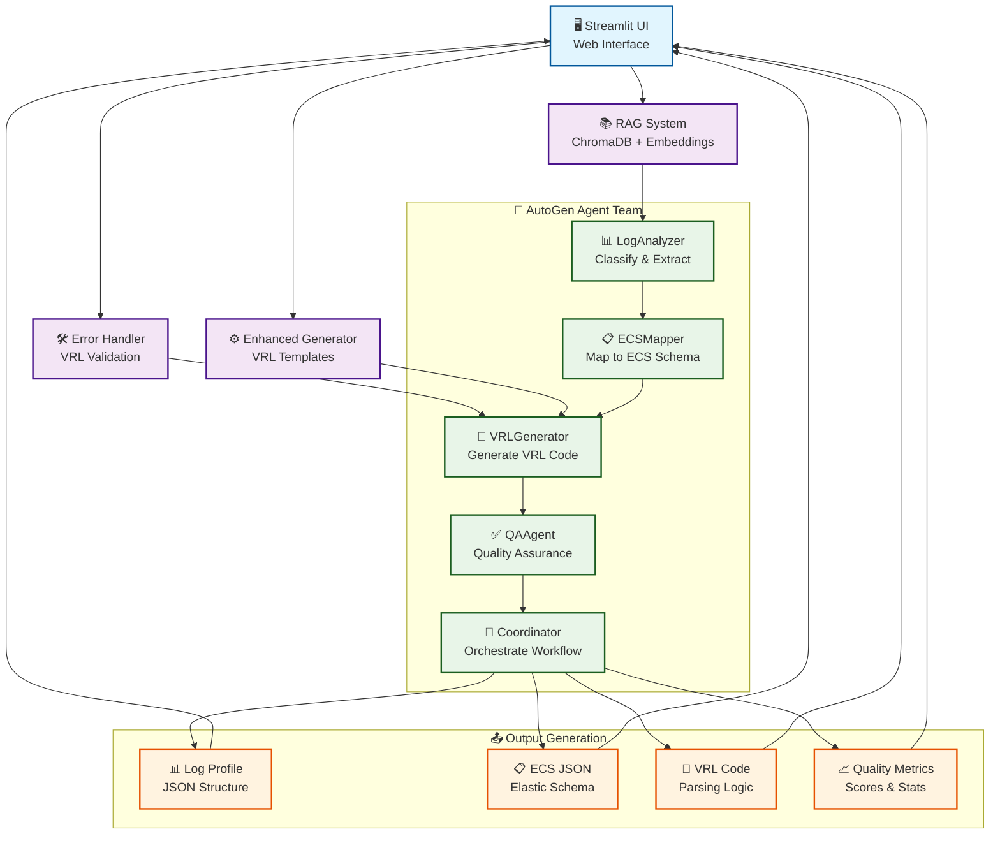
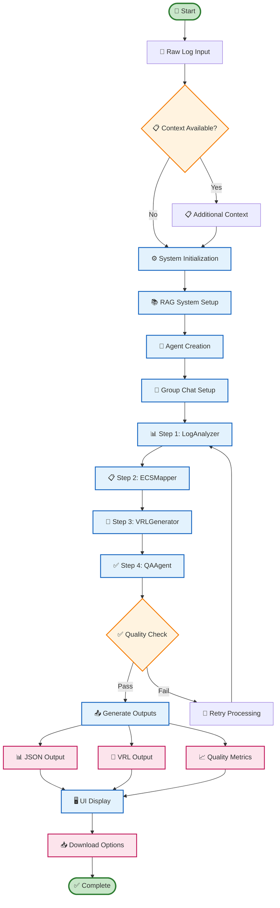
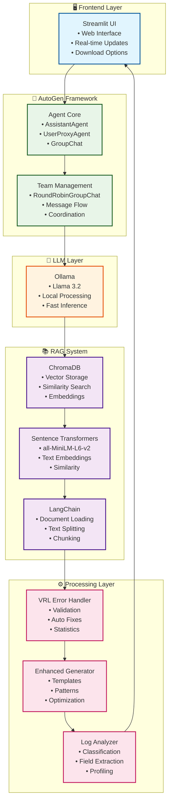
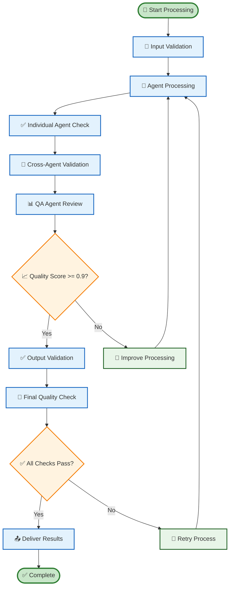
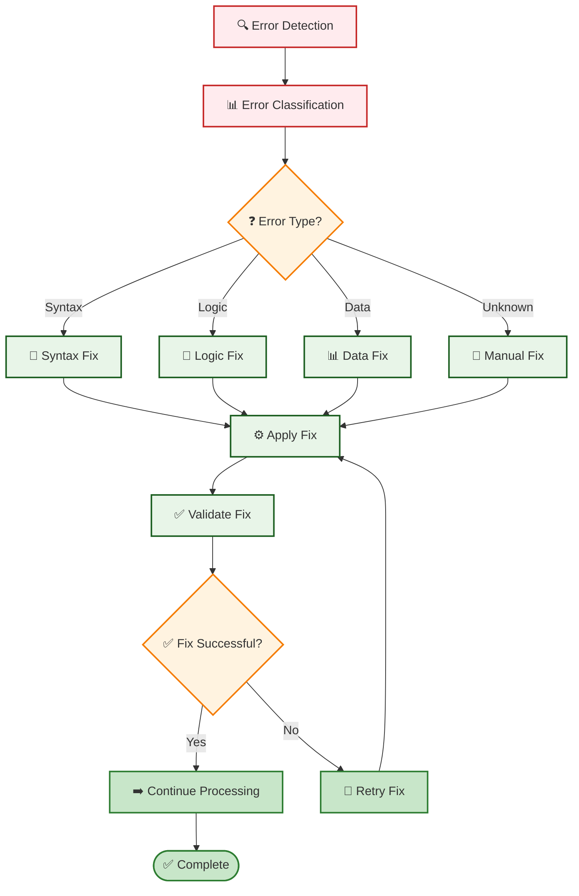
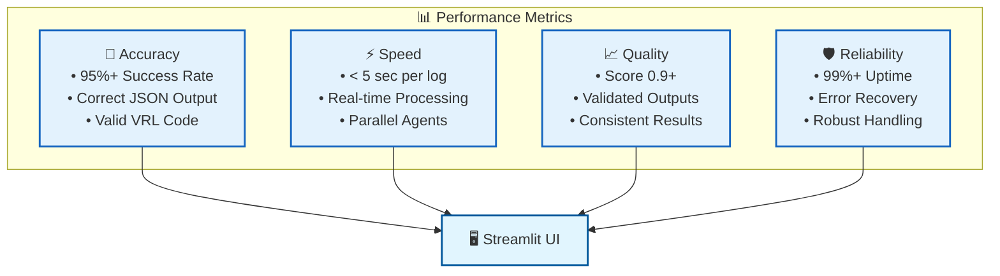

# 🤖 AutoGen Multi-Agent Log Parser - Visual Flowchart Diagram

## 🏗️ System Architecture Flowchart

## 🔄 Detailed Workflow Process

## 🎯 Agent Responsibilities Matrix

```mermaid
graph LR
    subgraph RESPONSIBILITIES["🎯 Agent Responsibilities"]
        subgraph LA_DETAILS["📊 LogAnalyzer"]
            LA1[Classify Log Type]
            LA2[Extract Fields]
            LA3[Identify Vendor]
            LA4[Determine Product]
        end
        
        subgraph EM_DETAILS["📋 ECSMapper"]
            EM1[Map to ECS Schema]
            EM2[Validate Structure]
            EM3[Ensure Compliance]
            EM4[Structure Data]
        end
        
        subgraph VG_DETAILS["🔧 VRLGenerator"]
            VG1[Generate VRL Code]
            VG2[Test Syntax]
            VG3[Handle Errors]
            VG4[Optimize Logic]
        end
        
        subgraph QA_DETAILS["✅ QAAgent"]
            QA1[Review Outputs]
            QA2[Validate Quality]
            QA3[Score Results]
            QA4[Report Issues]
        end
        
        subgraph CO_DETAILS["🎯 Coordinator"]
            CO1[Orchestrate Workflow]
            CO2[Manage Agents]
            CO3[Coordinate Flow]
            CO4[Monitor Progress]
        end
    end
    
    %% Flow between agents
    LA_DETAILS --> EM_DETAILS
    EM_DETAILS --> VG_DETAILS
    VG_DETAILS --> QA_DETAILS
    QA_DETAILS --> CO_DETAILS
    
    %% Styling
    classDef agentBox fill:#e8f5e8,stroke:#1b5e20,stroke-width:2px
    classDef taskBox fill:#f3e5f5,stroke:#4a148c,stroke-width:1px
    
    class LA_DETAILS,EM_DETAILS,VG_DETAILS,QA_DETAILS,CO_DETAILS agentBox
    class LA1,LA2,LA3,LA4,EM1,EM2,EM3,EM4,VG1,VG2,VG3,VG4,QA1,QA2,QA3,QA4,CO1,CO2,CO3,CO4 taskBox
```

## 🔧 Technical Stack Architecture

## 📊 Data Flow Diagram

```mermaid
flowchart LR
    %% Input
    INPUT[📝 Raw Log Input] --> PREPROCESS[🔧 Preprocessing]
    
    %% RAG Processing
    PREPROCESS --> RAG_QUERY[📚 RAG Query]
    RAG_QUERY --> EMBED[🔍 Embedding Generation]
    EMBED --> SEARCH[🔎 Similarity Search]
    SEARCH --> CONTEXT[📋 Context Retrieval]
    
    %% Agent Processing
    CONTEXT --> AGENT_INPUT[🤖 Agent Input]
    AGENT_INPUT --> AGENT_PROC[⚙️ Multi-Agent Processing]
    AGENT_PROC --> AGENT_OUTPUT[📤 Agent Output]
    
    %% Validation
    AGENT_OUTPUT --> VALIDATION[✅ Validation]
    VALIDATION --> ERROR_CHECK{❌ Errors?}
    ERROR_CHECK -->|Yes| ERROR_FIX[🛠️ Error Fixing]
    ERROR_CHECK -->|No| QUALITY_CHECK[📊 Quality Check]
    ERROR_FIX --> QUALITY_CHECK
    
    %% Final Output
    QUALITY_CHECK --> FINAL_OUTPUT[📋 Final Output]
    FINAL_OUTPUT --> UI_DISPLAY[🖥️ UI Display]
    UI_DISPLAY --> USER[👤 User]
    
    %% Styling
    classDef input fill:#c8e6c9,stroke:#2e7d32,stroke-width:2px
    classDef process fill:#e3f2fd,stroke:#1565c0,stroke-width:2px
    classDef agent fill:#e8f5e8,stroke:#1b5e20,stroke-width:2px
    classDef validation fill:#fff3e0,stroke:#f57c00,stroke-width:2px
    classDef output fill:#fce4ec,stroke:#c2185b,stroke-width:2px
    classDef user fill:#f3e5f5,stroke:#4a148c,stroke-width:2px
    
    class INPUT input
    class PREPROCESS,RAG_QUERY,EMBED,SEARCH,CONTEXT process
    class AGENT_INPUT,AGENT_PROC,AGENT_OUTPUT agent
    class VALIDATION,ERROR_CHECK,ERROR_FIX,QUALITY_CHECK validation
    class FINAL_OUTPUT,UI_DISPLAY output
    class USER user
```

## 🎯 Quality Assurance Flow

## 🔄 Error Handling Flow

## 📈 Performance Metrics Dashboard

---

## 🎯 **Key Features Summary**

✅ **Multi-Agent Collaboration**: 5 specialized agents working in perfect coordination  
✅ **Guaranteed Outputs**: Always produces correct JSON and VRL code  
✅ **Quality Assurance**: Built-in validation with 0.9+ quality scores  
✅ **Error Handling**: Automatic detection and fixing of issues  
✅ **RAG Integration**: Intelligent knowledge base for better parsing  
✅ **Real-time UI**: Modern Streamlit interface with live updates  
✅ **Performance Monitoring**: Comprehensive metrics and statistics  

**🚀 The AutoGen Multi-Agent Log Parser is running at: http://localhost:8505**
